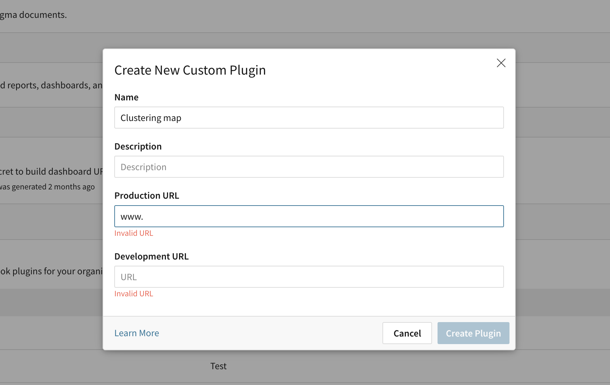
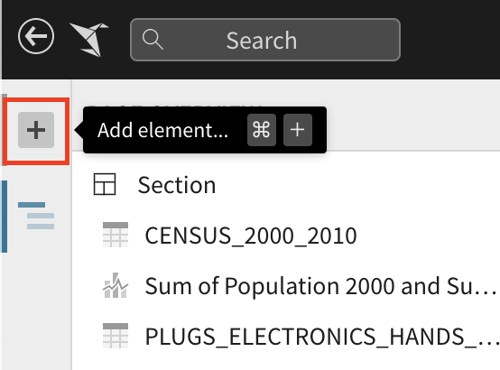
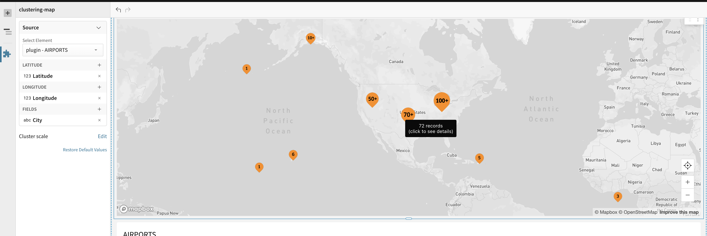
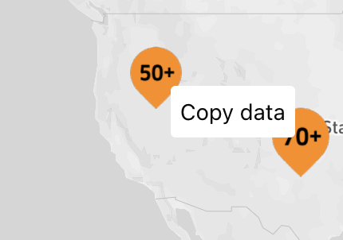

# Getting Started with Clustering Map Plugin

## Running/Developing This React App

If this is your first time running this app, navigate to the project directory and run the following command via your terminal:

### `yarn`

- Installs all necessary dependencies.

- You may skip this step if you have already run this command for this app previously.

After this, while still in the project directory, you can run:

### `yarn start`

- Runs the app in the development mode. Open the url (by default is [http://localhost:3000](http://localhost:3000)) to view it in the browser.

- The page will reload if you make edits. You will also see any lint errors in the console.

&nbsp;

## Deployment/Host the React App

**If you or your admin has already host this app for you, you can skip this step**

### `yarn build`

- Build a production version of the app.

### Host the app

- Host the app on cloud and make sure you can visit the app from the url

&nbsp;

## Registering This Plugin with Your Sigma Organization

**If you or your admin has already registered the plugin, you can skip this step**

### Requirements

- You must be an organization Admin to register a plugin.
- The plugin should be hosted; you will need to provide a production URL.

### Register a Plugin

1. Open your Admin portal.
2. Scroll to the "Custom Plugins" section on the "Account" page.

3. Click the section's "Add" button - this will open the "Create New Custom Plugin" modal.

4. Enter a Name for the plugin.
5. [optional] Enter a Description for the plugin.
6. Enter the plugin's Production URL.

7. Click "Create Plugin".

&nbsp;

## Using This App as a Sigma Plugin

1. Start off by creating a new workbook or opening an existing workbook. Make sure that your workbook has a data table in it that the plugin can read from.

2. Open the "Add element..." tab in the sidebar and add a Plugin (under "UI Elements").

3. Select the "Clustering map" plugin. Please contact your Organization Administrator if you cannot find it.

4. Select your source data table by selecting it in the "Select..." dropdown menu

5. Select correct `Latitude` and `Longitude` in the following channel. For the fields channel, you can add multiple fields which will show in the tooltip of the points on the map.

6. At this point. The map should be rendered with clusters.

Right click on a cluster/point will pop up a context menu, where you can copy the data to clipboard.

7. Optionally, we can put a number (at range of 1 ~ 100) in the `Cluster scale` channel, which will adjust the clustering size accordingly.
