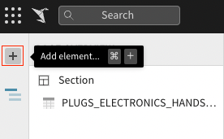
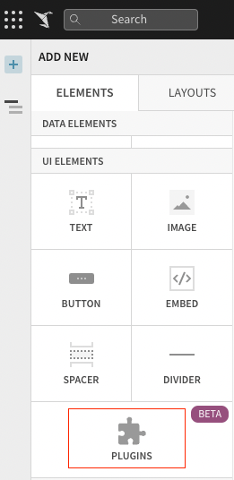
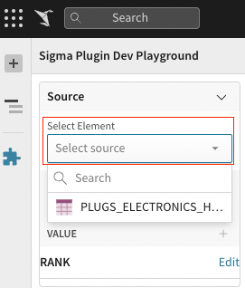
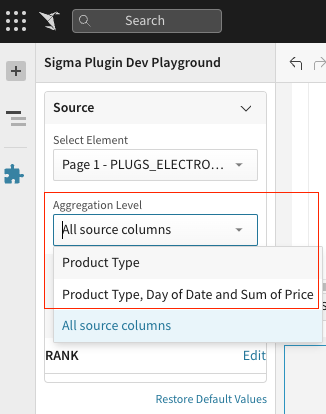
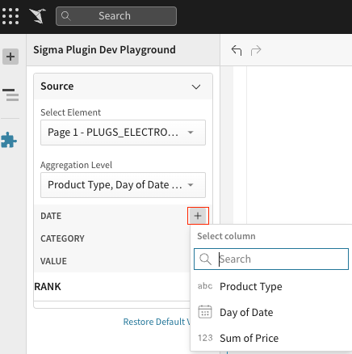
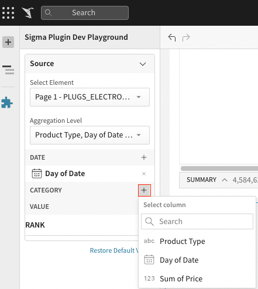
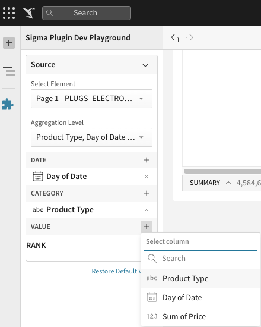
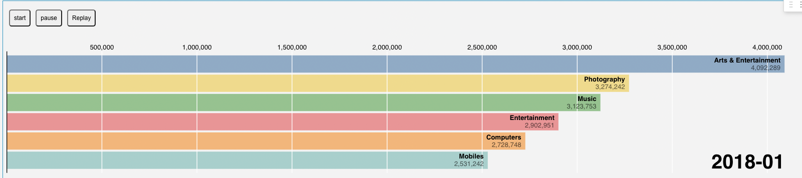
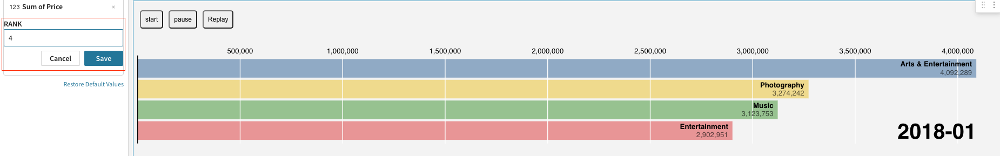
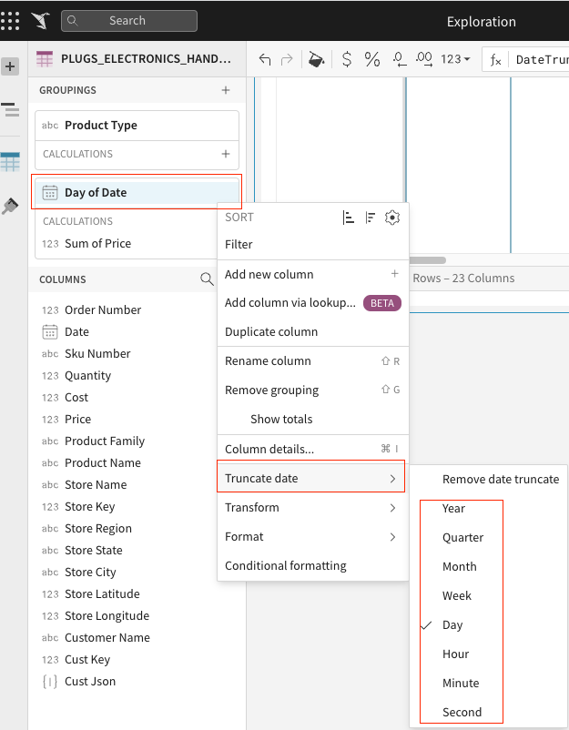

# Getting Started with Sigma Plugins

This project was bootstrapped with [Create React App](https://github.com/facebook/create-react-app).

## Running This React App

If this is your first time running this app, navigate to the project directory and run the following command via your terminal:

### `yarn`

- Installs all necessary dependencies.

- You may skip this step if you have already run this command for this app previously.

After this, while still in the project directory, you can run:

### `yarn start`

- Runs the app in the development mode. Open [http://localhost:3000](http://localhost:3000) to view it in the browser.

- The page will reload if you make edits. You will also see any lint errors in the console.

&nbsp;

## Using This App as a Sigma Plugin

1. Start off by creating a new workbook or opening an existing workbook. Make sure that your workbook has a data table in it that the plugin can read from.

2. Open the "Add element..." tab in the sidebar and add a Plugin (under "UI Elements").

   
   

3. Select the "Sigma Plugin Dev Playground" plugin, which plugin developers should have access to. Please contact your Organization Administrator if you cannot find this.

   

4. Select your source data table by selecting it in the "Select..." dropdown menu

   

5. If you have groupings in your data table that you wish for this plugin to take into account, select an option from the "Aggregation Level" dropdown menu.

   

6. Select your date, category and value by clicking on the "+" symbol next to these categories.

   
   
   

   Click on the "Replay" button and you should be able to view the bar chart race animation! You can also pause the animation by clicking on the "Pause". If you want to resume an animation, you can click the "Start".

   

7. You can also customize the ranking by entering the ranking and saving it.
   

8. You can change the grouping type of date by truncating date to year, month or day, the bar-chart-race will be displayed according to the changed type.

   

## Learn More

You can learn more in the [Create React App documentation](https://facebook.github.io/create-react-app/docs/getting-started).

To learn React, check out the [React documentation](https://reactjs.org/).
